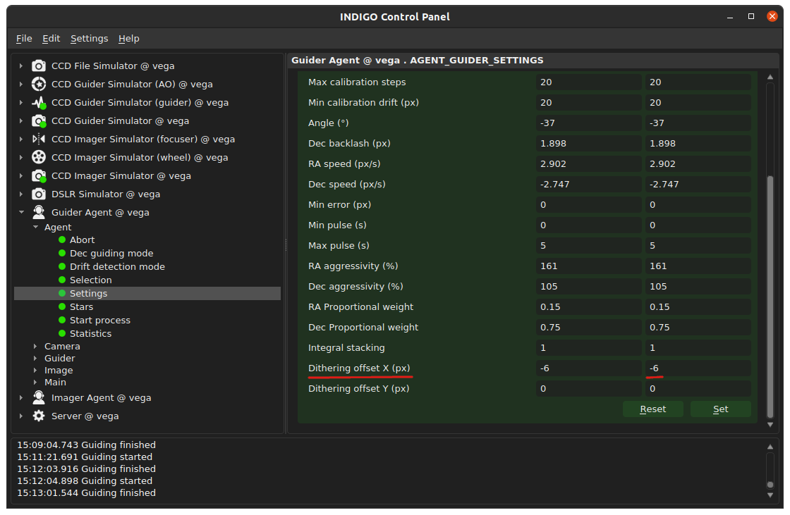
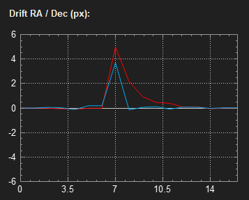
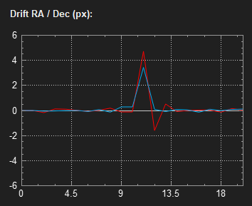
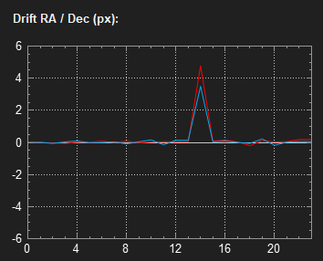
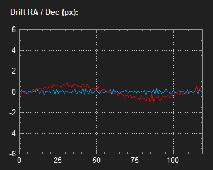
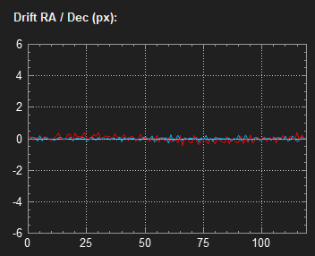

# INDIGO Guider Agent - PI Controller Tuning

Revision: 21.02.2021 (draft)

Author: **Rumen G.Bogdanovski**

e-mail: *rumen@skyarchive.org*

## Drift Controller Settings

Indigo_agent_guider uses *Proportional-Integral* (*PI*) controller to correct for the telescope tracking errors. *Proportional* or *P*
means that it will attempt to correct for any random errors like gusts of wind, random bumps etc. *Integral* or *I* means
that it will look at the last several frames and compensate for any systematic drifts like bad polar alignment, periodic
errors etc.

The drift controller has many parameters that can be configured. Some of them will be configured automatically
during the calibration process. The defaults for other settings should be good enough for most of the cases, however
to get the best performance one may need to tweak them.

Here we will look only in *Proportional Integral* controller settings. Which are described in the Guider Angent readme (link here).

* **RA Proportional aggressivity** and **Dec Proportional aggressivity** - They are the only parameters that are related to *P controller*. In most of the cases those two parameters will be enough to set. They represent how many percent of the last measured drift will be corrected.
The **Proportional aggressivity** is your primary term for controlling the error. this directly scales your error, so with a small **Proportional aggressivity** the controller will make small attempts to minimize the error, and with a large **Proportional aggressivity** the controller will make a larger attempt. If the **Proportional aggressivity** is too small you might never minimize the error and not be able to respond to changes affecting your system, and if it is too large you can have an unstable behavior and severely overshoot the desired value. A good initial value is ~90% for both RA and Dec.

* **RA Integral aggressivity** and **Dec Integral aggressivity** - These are the gains of the integral error. Or how strong should be the correction for the systematic (Integral) errors like Periodic error or bad polar alignment. Setting **RA Integral aggressivity** or **Dec Integral aggressivity** to 0 means P-only controller for Right Ascension or Declination respectively. If *PI controller* is needed a good value to start with would be ~50% for both RA and Dec. Please note that 100% does not correspond to 100% of the systematic error, there are many reasons for that. For example **Proportional aggressivity** may have already corrected most of the systematic error. So think of it as how strong the Integral component should react to the residual errors (after Proportional correction) accumulated over time. Also note that this term is often the cause of instability in your controller, so be conservative with it.

* **Integral stacking** - the history length (in number of frames) to be used for the *Integral* component of the controller. If stacking is 1 (regardless of the values of the **RA Integral aggressivity** and **Dec Integral aggressivity**) the controller is pure *Proportional* as there is no history.
Default value is 1 which means that pure *P controller* is used, but if a *PI controller* is needed a good initial value would be around 10.

* **Dithering offset X** and  **Dithering offset Y** - Add constant offset from the reference during guiding in pixels. The values are reset to 0 when a guiding process is started. We will need those to params to check the impulse response of the guider while tunning.

## Tuning the Drift Controller (P-only controller)

1. Set **RA Integral aggressivity** and **Dec Integral aggressivity** to 0 and **Integral stacking** to 1.
(P-only Controller). And set **RA Proportional aggressivity** and **Dec Proportional aggressivity** to ~90%.

2. Start the guiding and after it settles set dithering offset to X (or Y) of several pixels (5 or 6 px is OK) to simulate a bump in the guiding as shown on the screenshot:

3. Check the guiding response. If the response is too slow like on the picture, the **Proportional aggressivity** for this axis should be increased. In this case the red line is Right Ascension so we need to boost **RA Proportional aggressivity**.

4. If the guiding response is overshooting, **Proportional aggressivity** Should be decreased. Here we went too far with **RA Proportional aggressivity** and we need to reduce it.

5. Repeat the process until response is fast and accurate (as shown)

With this the Proportional controller tuning is complete. And it is safe to stop here. It will perform excellent for most of the cases.

## Tuning the Drift Controller (PI controller)
PI controller is needed in rare cases when there is are significant systematic errors like periodic error (PE) or significant drift due to a bad polar alignment that can not be compensated by the *P-only* controller. If the issue is bad polar alignment it is strongly advised to invest time in better alignment. In case of a periodic error it usually manifests when long guiding cycles of more than 10 seconds are used. In most of the cases this can be fixed by reducing the cycle to 2-3 seconds.

If this does not help and there is a drift or the mount PE is still visible in the guiding graph, as shown below then *PI controller* is here to help.

### Tuning Procedure
1. Perform the P-only controller tuning procedure, if it is not completed, as described above.

2. Set the **Integral stacking** to a reasonable value ~10-15 frames.

3. Set the **Integral aggressivity** to around 50% for the axis that shows the error (in this case RA is showing significant PE). Let it run for several minutes (a full PE cycle).

4. Check the if the error is still there. If so, increase **Integral aggressivity** (in 5 - 10% steps) and let it run several more minutes.

5. Repeat step 4 until the error is gone. Please be conservative with **Integral aggressivity** as bringing it way up may result in slow drifts, jumps or oscillations around the set point. Sometimes it is preferable to leave a bit of the error but not sacrificing the stability, how much depends on your setup, seeing and etc, as long as the stars look round on the imaging sensor is totally fine even if it shows some residual PE on the graph.

6. Now we need to test its response to sudden jumps again, as described above in the P-only controller tuning section but this time with the I component turned on. If we have over reaction or slow reaction the **Proportional aggressivity** for the corresponding axis should be adjusted again.

This is how a well tuned controller should perform:

Please note that if you have bad polar alignment guiding will not save you from field rotation.

Clear skies!
