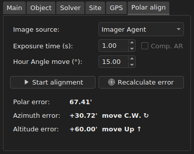

# INDIGO Astrometry / ASTAP Agent - Polar Alignment Guide

Revision: 02.20.2022 (draft)

Author: **Rumen G.Bogdanovski**

e-mail: *rumen@skyarchive.org*

## Introduction

Polar alignment procedure uses 3 point polar alignment. It will move the telescope twice in Hour Angle with a specified amount and will take one exposure at start, one in the middle and one at the end and will calculate the polar error and give a clear instructions how to correct it. Currently Atmospheric refraction is not taken in to account and for better results the mount should be trained above 35-40 degrees in altitude. A good starting point is 45-50 degrees in Altitude, just passed the meridian. It is not mandatory but this way meridian flip will be avoided and usually the mount can safely move the required distance.    

## Configuration
- **Exposure time** - This is the exposure time in seconds used for the frame acquisition usually several seconds is enough.
- **Hour angle move** - This is how much the mount should move in Hour angle (-RA) between the exposures. Positive value will move the mount Clockwise, negative - Counterclockwise. Recommended value is something between 15 and 25 degrees.  
- **Related Agents** - The polar alignment will work only if image source agent and the mount agent is selected which will command the mount to be aligned. This is usually done in the client. This is how it looks in Ain INDIGO Imager ("Mount Agent @ vega" with "Mount Simulator" selected with images from "Imager Agent"):

 

## Running the process
1. Point the mount above 35-40 degrees in altitude and preferably close to the meridian. If **Hour angle move** is negative you should be before the meridian and if positive past the meridian to avoid meridian flip. Please note if the final position is close to 90 degrees azimuth (due east) or 270 degrees azimuth (dew west) the polar alignment calculation will not be accurate. This is another reason to start close to the meridian.
2. Click on "Start alignment" this will take some time. The agent will take three exposures and solve them, and move mount between them. When it is done it will show the error and give you clear instructions how to correct the error:

 

 And will print in the log messages like this:

 ```
 03:39:57.092 Polar error: 67.41'
 03:39:57.092 Azimuth error: +30.72', move C.W. (use azimuth adjustment knob)
 03:39:57.092 Altitude error: +60.00', move Up (use altitude adjustment knob)
 ```

3. Follow the instructions and move the mount polar axis using the altitude and azimuth polar alignment knobs. **Do not touch Right ascension and Declination**. Moving in Right ascension or Declination will lead to wrong polar error estimation and wrong polar alignment. In this example we should move clockwise (C.W.) in azimuth and up (Up) in altitude.

4. Now click "Recalculate error". This will take another exposure and give you another polar error estimate:

 ```
 03:40:34.664 Polar error: 18.89'
 03:40:34.665 Azimuth error: +11.64', move C.W. (use azimuth adjustment knob)
 03:40:34.665 Altitude error: +14.88', move Up (use altitude adjustment knob)
 ```

5. Repeat steps 3 and 4 until the polar error is acceptable:

 ```
 03:41:36.800 Polar error: 0.87'
 03:41:36.801 Azimuth error: +0.84', move C.W. (use azimuth adjustment knob)
 03:41:36.801 Altitude error: -0.24', move Down (use altitude adjustment knob)
 ```

## Notes
1. If the initial error is larger than 5 degrees the process will fail and ask for better initial polar alignment.
2. If the initial error is more than 3 degrees it is recommended to repeat the process for better accuracy.
3. The polar error estimate may vary between different runs with several arc minutes. There are many reasons for that - cone error, periodic error, backlash, camera pixel scale etc. Do not be too picky on that.
4. Polar error of several arc minutes (even up to 10') is ok for most of the cases.

Clear skies!  
